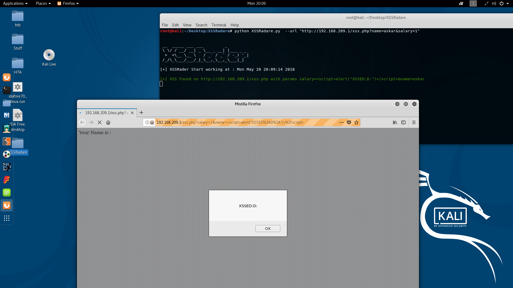
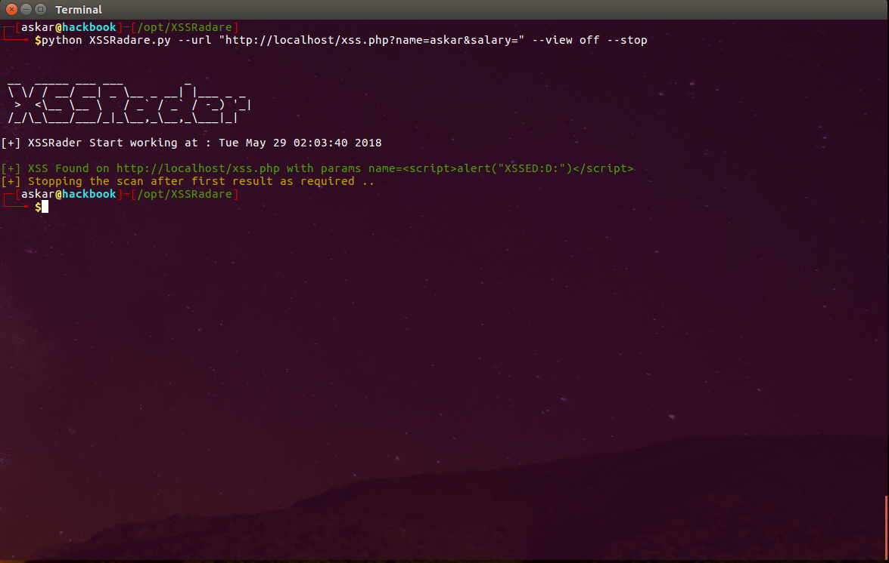

# XSSRadare (beta version)


### Cross Site Scripting (XSS) scanner based on selenium webdriver

using XSSRadare you can scan a single URL or mulitple URLs from XSS by using selenuim web driver as a fuzzing interface , XSSRadare will help you to identify any XSS vulnerability in your web application.

XSSRadare will use some hardcoded payloads to test for XSS , for now we prefer to write payload that conatins ```alert``` javascript function because we already implemented the fuzzer to test for any alert triggered in the scaned page. 

### Requirements : 

You can install all the dependencies for XSSRadare using the following commands : 

```askar@hackbook:~# sudo ./system_requirments.sh ```

And make sure to add this line to your ```.bashrc``` file manually :

``` export PATH=$PATH:/opt/geckodriver ```

This line will make sure to link the geckodriver path to your current ```PATH``` so the XSSRadare can recognize it.

##### Note : sometimes you need to check your firefox compatibility with geckodriver in order to run the script correctly (currently we are using the latest one "geckodriver-v0.20.1 x64" version) please note the the current version of firefox on kali linux is (firefox 52) which is not supported by the geckodriver version that we are using , so make sure to upgrade your firefox version if you are using kali linux , we are working on build a script to automate the whole process for you.

### Usage : 

After installing all the dependencies , you can run this command to start XSSRadare :

``` 
askar@hackbook:~# python XSSRadare.py  -h

 \ \/ / __/ __| _ \__ _ __| |___ _ _
  >  <\__ \__ \   / _` / _` / -_) '_|
 /_/\_\___/___/_|_\__,_\__,_\___|_|

[+] XSSRader Start working at : Tue May 29 01:39:59 2018

usage: XSSRadare.py [-h] [-u URL] [-v VIEW] [--stop] [--negative] [-fi FILE]

optional arguments:
  -h, --help            show this help message and exit
  -u URL, --url URL     URL to scan
  -v VIEW, --view VIEW  view firefox (on/off)
  --stop                stop when you find a vulnerability
  --negative            show negative attempts
  -fi FILE, --file FILE
                        name of the urls file to scan


```

This command can be explained as following :

- -h : to show this help banner.
- --url : the URL you want to scan.
- --view : to choose if you want to show the firefox browser during the fuzzing , you can control it by use (on / off) flags.
- --stop : XSSRadare will stop fuzzing once it found any XSS.
- --negative : to show the negative scan results (something like verbose).
- --file : file name that contains all URLs that you want to scan.

You can start a simple XSS scan for a url using the following command : 

```
askar@hackbook:~# python XSSRadare.py --url "http://localhost/xss.php?name=askar&age=21"
 __  _____ ___ ___         _
 \ \/ / __/ __| _ \__ _ __| |___ _ _
  >  <\__ \__ \   / _` / _` / -_) '_|
 /_/\_\___/___/_|_\__,_\__,_\___|_|

[+] XSSRader Start working at : Tue May 29 01:49:22 2018

[+] XSS Found on http://localhost/xss.php with params age=21&name=<script>alert("XSSED:D:")</script>
[+] Scan finished , number of found XSS : 1 

askar@hackbook:~#
```

### Screenshots :




